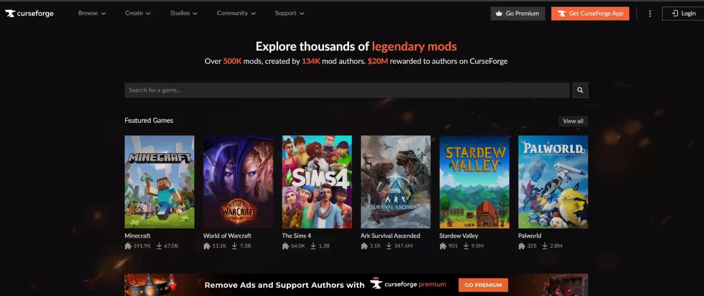

# Vanilla Minecraft server For newest version

Fyi: To get the link to use wget you have to righ-click on the lick on the site and click copy link


<br>

```sh
   # Download Open jdk (java)
   sudo apt install openjdk-21-jdk

   # Now make a folder on your desktop or where you want it
      mkdir name

      cd "name" # Go to the folder you just made 

   # Now go to this site and download the minecraft_server or use the script to download the server file. 
   https://www.minecraft.net/en-us/download/server #Right click on the minecraft_server link and type Wget ant the link
   
   wget https://piston-data.mojang.com/v1/objects/45810d238246d90e811d896f87b14695b7fb6839/server.jar
   
   # In the folder you just made run the follwing command
   java -jar server.jar    # The command made all the files needed 

   
      # Now change the eula from false to true 
      ls
      
      nano eula.txt

   # Create the config file that makes you bale to change ram config
   nano start.sh

      # Now past this command( #!/bin/sh is part of the script):
      
      #!/bin/sh
      java -Xms2094M -Xmx6144M -jar server.jar # You change the -Xms and -Xmx to configure min- maximum ram
                                                     # Now click crt-O to save and crt-X to exit
   
   # Now open the port that minecraft is using 
   sudo ufw allow 25565

   # You should then be back in terminal. to run the file, you have to mark the file as an executable. 
   sudo chmod +x start.sh

   # And now to start the server 
   sudo ./start.sh

   # how to find the server ip 
   ip a # This will show you all the ip addresses on your computer. Look for the one that either a 192, 172 or 10 ip


   # If you want to stop the server type stop in the consoll
   stop 
```

# Modded Minecraft server

<br>

   Fyi:

 
   This is how to get forge. More detailes in step 2.
   <br>
   To get forge go to https://files.minecraftforge.net/net/minecraftforge/forge/ Or type forge in the browser
   <br>
   I sugest you get your mods from curseforge

<br>

```sh
   # Make sure you have java installed (jdk) if not run this command 
   sudo apt install openjdk-21-jdk

   # Now you have to find out witch version of forge you need. i will use 1.20.1 in this Tutorial 
   # To get the link you have to first click on the installer and then get the link from the skip button
   wget https://maven.minecraftforge.net/net/minecraftforge/forge/1.20.1-47.3.0/forge-1.20.1-47.3.0-installer.jar

   # When you have your file run this 
   ls 
   java -jar "filename" --installServer
   # Now way untill the download is done

   #If you want to change the maximum ram use this command and then change the -Xmx4G to your desired max ram 
   nano user_jvm_args.txt # You have to remove the hastage before -Xmx4G
   
   # Now we are almost done, but we need to start the server for the first time and accept eula 
   ./run.sh # This starts the server 
   nano eula.txt # This allows us to change the eula to true

   # If you type "ls" now you will see a mod folder. Move into the folder and put your mods here. There are multiple ways to download mod and here is a exemple.
   # This is a example mod and may not work for your version:
   wget https://mediafilez.forgecdn.net/files/5393/334/ZZ.JJThunder_To_The_Max_1.20.1_v0.2.0.jar # If you need help to get the link follow the video bellow 


   # Now all you need to do is start the server
   ./run.sh

   # If you want to change the configs of the server
   nano server.properties

   # if you want to give yourself operator/op 
   op "minecraft name"


```

  Wget forge mods tutorial: <br>
   <a href="https://udeoslokommuneno-my.sharepoint.com/:v:/g/personal/kifoa001_osloskolen_no/EVFQx33T5uBMj3wPrJbWTEUBbOgtj-JF_z2Ko0t4wBxVrw?nav=eyJyZWZlcnJhbEluZm8iOnsicmVmZXJyYWxBcHAiOiJPbmVEcml2ZUZvckJ1c2luZXNzIiwicmVmZXJyYWxBcHBQbGF0Zm9ybSI6IldlYiIsInJlZmVycmFsTW9kZSI6InZpZXciLCJyZWZlcnJhbFZpZXciOiJNeUZpbGVzTGlua0NvcHkifX0&e=e0sRy0">   </a>